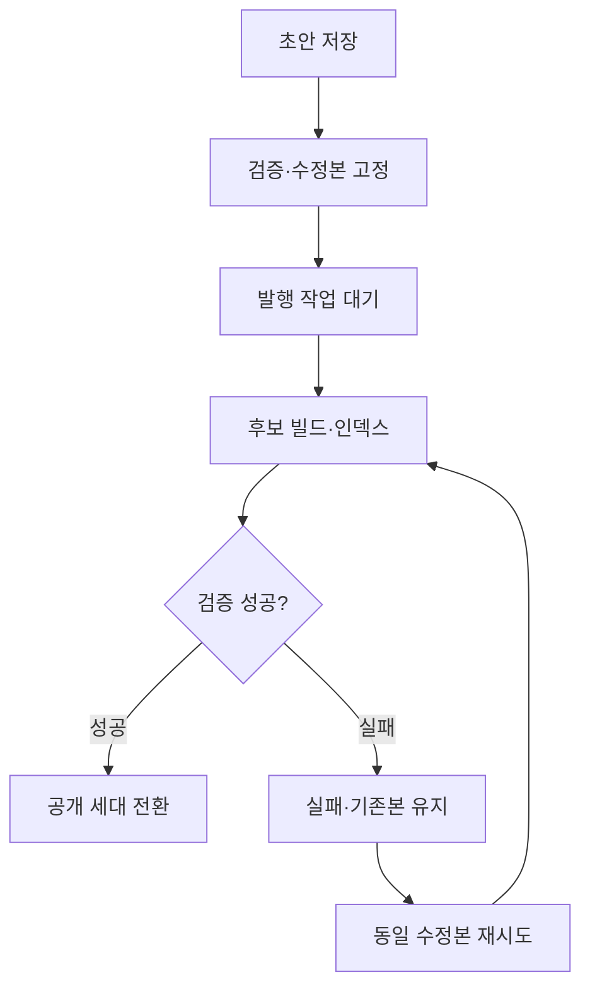

# 03_publication

```mermaid
flowchart TD
 A[초안 저장] --> V[검증·수정본 고정]
 V --> Q[발행 작업 대기]
 Q --> B[후보 빌드·인덱스]
 B --> T{검증 성공?}
 T -->|성공| P[공개 세대 전환]
 T -->|실패| F[실패·기존본 유지]
 F --> R[동일 수정본 재시도]
 R --> B
```
