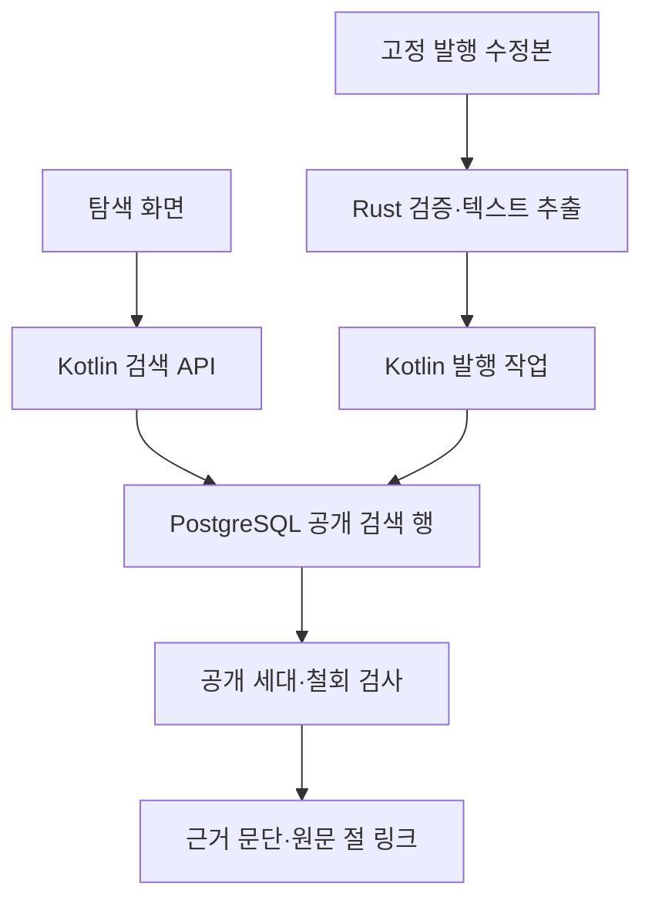

# 공개 검색 흐름 — v5.0

파일명은기존링크호환을위해유지하며RAG는범위제외입니다.

```mermaid
flowchart TD
 U[탐색 화면] --> K[Kotlin 검색 API]
 K --> P[PostgreSQL 공개 검색 행]
 P --> V[공개 세대·철회 검사]
 V --> R[근거 문단·원문 절 링크]
 S[고정 발행 수정본] --> T[Rust 검증·텍스트 추출]
 T --> J[Kotlin 발행 작업]
 J --> P
```
