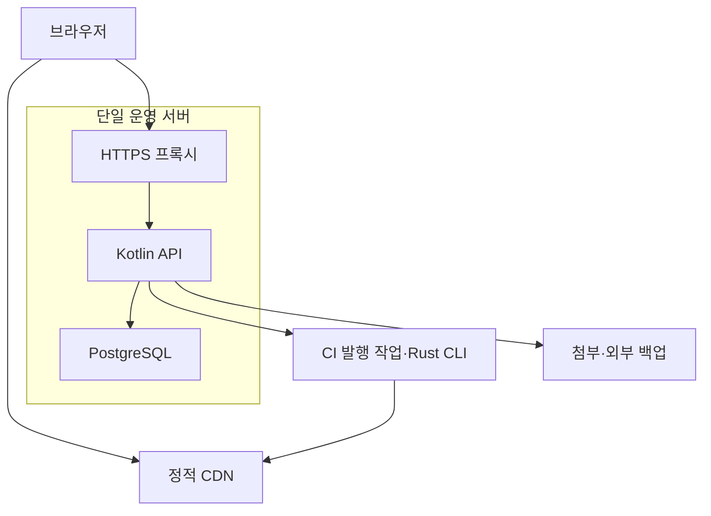

# 초기 운영 배치 — v5.0

```mermaid
flowchart TD
 B[브라우저] --> CDN[정적 CDN]
 B --> PX[HTTPS 프록시]
 subgraph HOST[단일 운영 서버]
 PX --> API[Kotlin API]
 API --> DB[PostgreSQL]
 end
 API --> JOB[CI 발행 작업·Rust CLI]
 JOB --> CDN
 API --> OBJ[첨부·외부 백업]
```

노트북은개발기기이며이운영서버가아닙니다. CI러너·호스팅·저장비용은M6에서확인합니다.

## 작업형 워커

Python workflow profile·수동/timer 기동·checkpoint 영역은 [[WF06_OPERATIONS]]를 적용합니다. 상시 Python API를 추가하지 않습니다.
