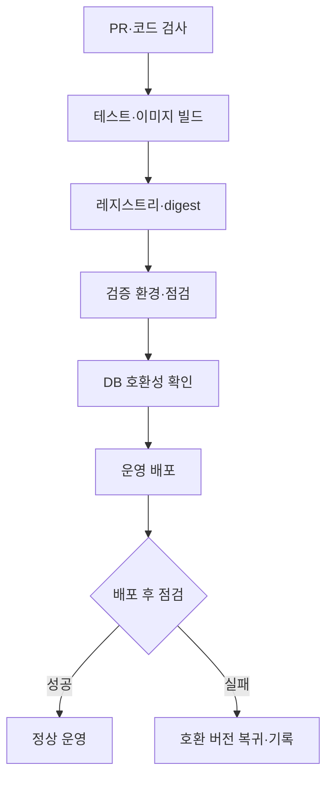

# 07_cicd

```mermaid
flowchart TD
 PR[PR·코드 검사] --> B[테스트·이미지 빌드]
 B --> R[레지스트리·digest]
 R --> S[검증 환경·점검]
 S --> M[DB 호환성 확인]
 M --> P[운영 배포]
 P --> G{배포 후 점검}
 G -->|성공| OK[정상 운영]
 G -->|실패| RB[호환 버전 복귀·기록]
```
