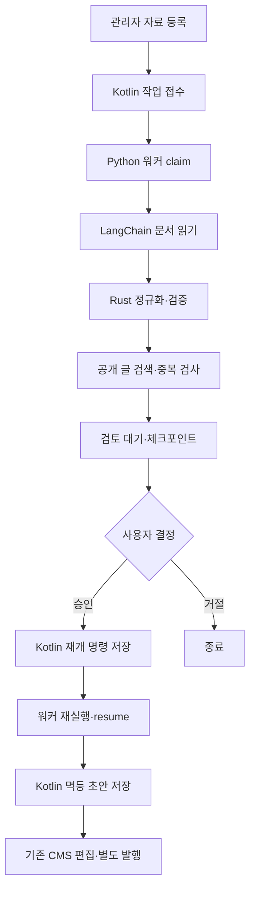

# 자료 처리 흐름

```mermaid
flowchart TD
    A[관리자 자료 등록] --> B[Kotlin 작업 접수]
    B --> C[Python 워커 claim]
    C --> D[LangChain 문서 읽기]
    D --> E[Rust 정규화·검증]
    E --> F[공개 글 검색·중복 검사]
    F --> G[검토 대기·체크포인트]
    G --> H{사용자 결정}
    H -->|승인| I[Kotlin 재개 명령 저장]
    H -->|거절| J[종료]
    I --> K[워커 재실행·resume]
    K --> L[Kotlin 멱등 초안 저장]
    L --> M[기존 CMS 편집·별도 발행]
```

검토 대기에는 실행 프로세스가 필요하지 않습니다. 영속 저장과 재실행 기동 장치는 별도 구현합니다. [[WF03_STATE_MACHINE]]
