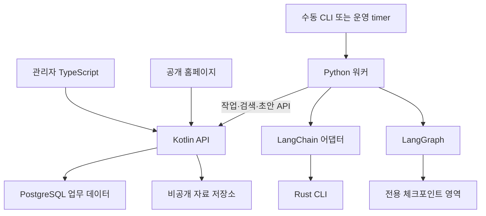

# 자료 워크플로와 기존 시스템의 연결

```mermaid
flowchart TD
    UI[관리자 TypeScript] --> API[Kotlin API]
    WEB[공개 홈페이지] --> API
    API --> DB[PostgreSQL 업무 데이터]
    API --> OBJ[비공개 자료 저장소]
    TIMER[수동 CLI 또는 운영 timer] --> PY[Python 워커]
    PY -->|작업·검색·초안 API| API
    PY --> LC[LangChain 어댑터]
    PY --> LG[LangGraph]
    LC --> R[Rust CLI]
    LG --> CP[전용 체크포인트 영역]
```

DB와 체크포인트는 같은 PostgreSQL 인스턴스 내 권한 분리 영역을 사용할 수 있습니다. Python은 CMS 테이블 직접 쓰기 권한이 없습니다. [[WF02_ARCHITECTURE]]
