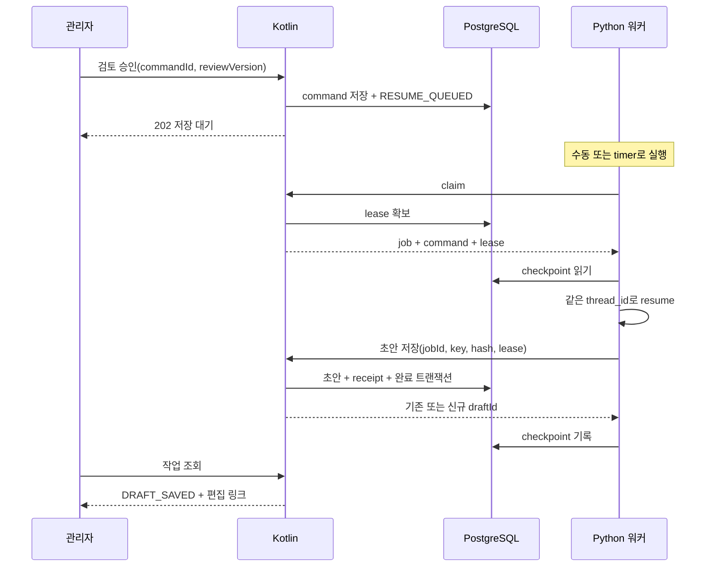

# 승인·재개·멱등 저장

```mermaid
sequenceDiagram
    participant U as 관리자
    participant K as Kotlin
    participant D as PostgreSQL
    participant W as Python 워커
    U->>K: 검토 승인(commandId, reviewVersion)
    K->>D: command 저장 + RESUME_QUEUED
    K-->>U: 202 저장 대기
    Note over W: 수동 또는 timer로 실행
    W->>K: claim
    K->>D: lease 확보
    K-->>W: job + command + lease
    W->>D: checkpoint 읽기
    W->>W: 같은 thread_id로 resume
    W->>K: 초안 저장(jobId, key, hash, lease)
    K->>D: 초안 + receipt + 완료 트랜잭션
    K-->>W: 기존 또는 신규 draftId
    W->>D: checkpoint 기록
    U->>K: 작업 조회
    K-->>U: DRAFT_SAVED + 편집 링크
```

초안 응답 유실 후 같은 key로 재호출하면 receipt로 같은 결과를 반환합니다. [[WF04_DATA_API]]
